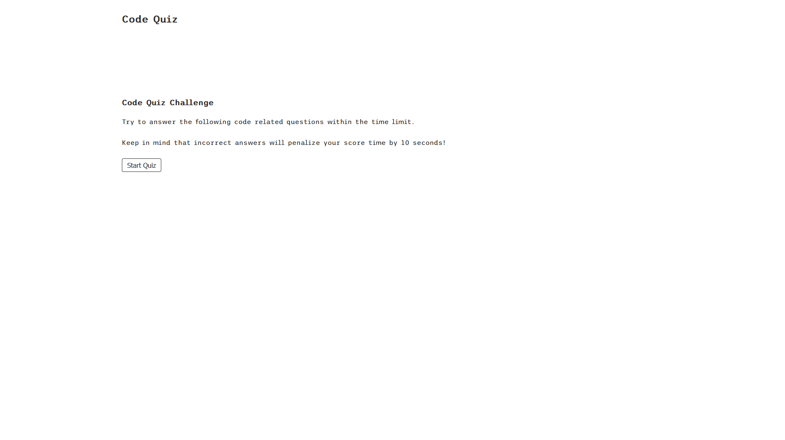

# Description

In this assignment, our task was to create a coding quiz that is powered by Javascript.

When the user starts the quiz, a 60 second timer starts and the user is presented with 5 questions one at a time.

If the user gets a question correct, they receive a prompt and 20 points. If the user gets a question incorrect, they also receive a prompt and 10 seconds is removed from the timer.

If the timer runs to 0, the quiz is over and the user's score is tallied and they receieve a prompt to save their score. If the user completes the quiz before the timer ends, their score is tallied and they receieve a prompt to save their score.

Once the user enters their intials, they're able to see previously saved scores.

---

I was able to complete all requirements for this assignment, except one issue I couldn't solve that results from the timer running to 0 and the user retaking the test. When doing so, Question 1 correctly appears, however the browser treats the question as whatever question the user was on when the timer ran to 0, causing an incorrect answer. However, if the user finishes the quiz before the timer runs out or an incorrect answer causes the timer to go below 0, the user is able to retake the quiz without issue.

# Screenshot

# Link

(https://eriksvetlik.github.io/codequiz/)
